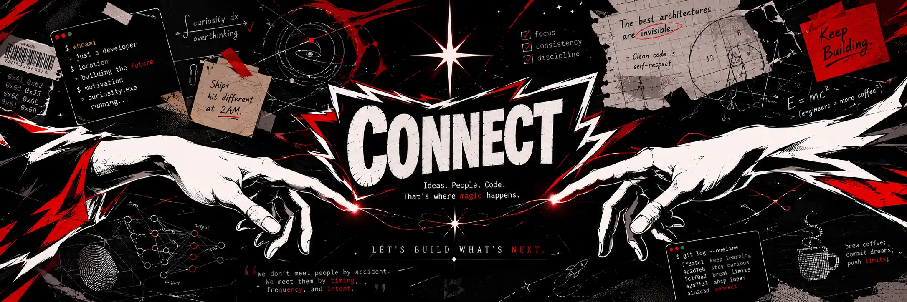

<h1 align="center">Hi, I'm Ankit Thapa Magar 👋</h1>

GitHub: <a href="https://github.com/ankeetmgr">@ankeetmgr</a>

<h2 align="center">Tech I Use</h2>

  
  
  
  
  
  
  
  

  

 

  
  

  

  

 

  

